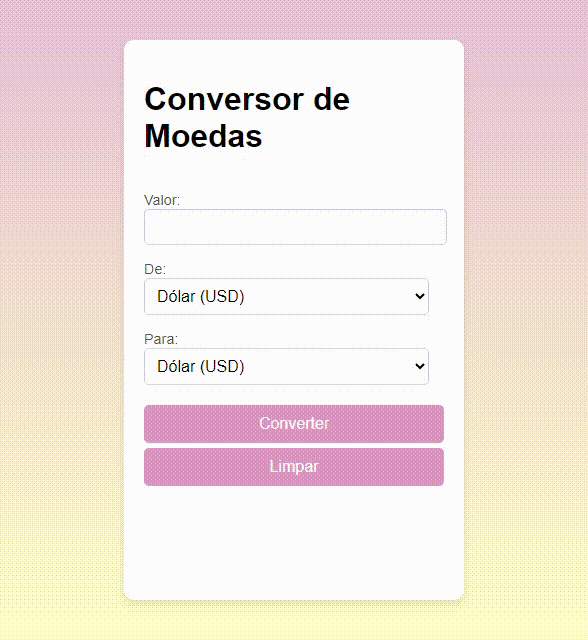

# Conversor de Moedas com Cotações em Tempo Real
## Índice
* [Sobre o projeto](#sobre-o-projeto)
* [Objetivo](#objetivo)
* [Funcionalidades](#funcionalidades)
* [Visual](#visual)
* [Tecnologias Utilizadas](#tecnologias-utilizadas)
* [Como funciona](#como-funciona)
* [Funções do Javascript](#funções-do-javascript)

## Sobre o Projeto
Este projeto é um conversor de moedas que permite calcular o valor de uma moeda em outra usando cotações de câmbio atualizadas em tempo real. Ele foi feito com base em um projeto anterior mais simples, que usava taxas fixas, mas agora é capaz de pegar as taxas atuais usando a API *ExchangeRate*.

## Objetivo
O Conversor de Moedas com Cotações em Tempo Real foi feito para ajudar quem precisa acompanhar o valor das moedas de um jeito rápido e preciso. É uma aplicação simples e prática, onde o usuário pode inserir um valor, escolher a moeda de origem e a moeda para conversão, e ver o resultado na hora.

## Funcionalidades
- Conversão entre Dólar (USD), Euro (EUR) e Real (BRL).
- Taxas de câmbio atualizadas em tempo real pela API *ExchangeRate*.
- Exibição direta do valor convertido.
- Validação para garantir que um valor válido foi inserido.
- Botão de limpar para reiniciar o formulário para uma nova conversão.

## Visual

A interface é simples e fácil de usar, com um fundo em degradê rosa e amarelo que deixa o visual agradável e bonito. O layout é organizado de forma prática, com todos os campos necessários para a conversão em um só lugar.

## Tecnologias Utilizadas
- **HTML5** para estruturar a página.
- **CSS3** para o design do formulário e responsividade.
- **JavaScript** para as funções que capturam e processam os dados do usuário, conectam com a API, e mostram o resultado.
- **API ExchangeRate** para fornecer as taxas de câmbio atualizadas.

## Como Funciona
Este projeto é uma melhoria de um projeto anterior, onde as taxas de câmbio eram fixas. Agora, a API *ExchangeRate* é usada para buscar as taxas mais recentes, o que faz com que o resultado seja mais preciso e útil.

## Funções do JavaScript
- **Função `getExchangeRate(fromCurrency, toCurrency)`**: Usa a API *ExchangeRate* para buscar a taxa de câmbio entre a moeda de origem e a moeda para conversão. Faz uma chamada assíncrona (`async`) para trazer a taxa atualizada.
 - **Chave da API (API Key)**: A API é acessada por uma chave (`apiKey`) e retorna as taxas em formato JSON.
 - **Verificação de Erros**: Se a resposta da API não for bem-sucedida, a função exibe um erro no console e retorna `null`.
- **Formulário com `addEventListener`**: Essa função captura o envio do formulário para calcular o valor convertido e exibe o resultado no `p#conversao`, formatado com duas casas decimais.